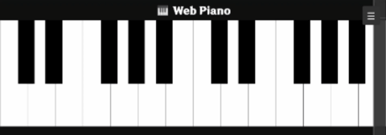
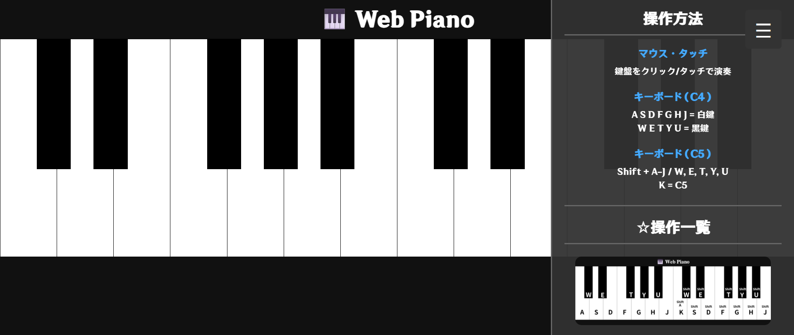

<h1>WebPiano</h1>

☆<a href="https://webpiano.onrender.com/" target="_blank">こちら</a>からアクセスできます

本作品は、PythonとFlaskを用いて制作したブラウザ上で演奏可能な Webピアノアプリである。スマートフォンやPCのブラウザからアクセスするだけで、インストール不要で鍵盤演奏を楽しめる。音域はC4からB5までの2オクターブを実装している。
また、Web版に加えて、Pygameを使用したアプリ版も実装した。

言語はHTML・CSS・JavaScriptを用い、JavaScriptによって鍵盤を動的に生成する構成を採用した。これにより、鍵盤数の変更や拡張が容易になり、可読性・保守性の高いコード構造となっている。

<h1> 操作方法 </h1>
タッチ操作とマウス操作の両方に対応しており、スマートフォン・タブレット・PCのいずれでも演奏可能である。複数の鍵盤を同時に押すことで和音を鳴らすこともでき、実際のピアノに近い演奏体験を実現している。
また、キーボード操作も可能でページの右上には操作方法を見る欄がある。

  
  →
  

☆操作一覧

バックエンドにはFlaskを用い、テンプレート機能によってHTMLを配信し、CSS・JavaScript・音声ファイルなどの静的ファイルを整理された構成で管理している。完成したアプリケーションは、クラウドサービスである Renderを利用してデプロイを行った。Renderを使用することで、GitHubと連携した自動デプロイ環境を構築し、ローカル環境だけでなくインターネット上からもアクセス可能なWebアプリとして公開できた。

制作時期
2026年1月

